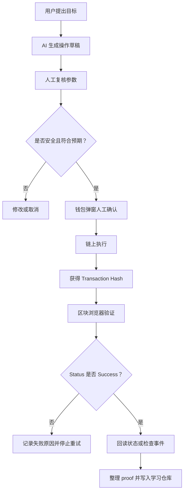

# Week 1｜AI x Web3 综合任务｜画出 AI x Web3 最小交叉流程图

日期：2026-05-27

## 提交用途

用于 WCB Week 1 任务：

```text
Week 1｜AI x Web3 综合任务｜画出 AI x Web3 最小交叉流程图
```

## 最小交叉流程图



## 节点说明

- 用户提出目标：目标必须具体到网络、合约、函数、参数或转账对象。
- AI 生成操作草稿：AI 可以生成步骤、参数清单、ABI 解读、脚本草稿、风险提醒和 proof 模板。
- 人工复核参数：检查 Network / chainId、From、To / Contract Address、Function、Args、Value、Data、Gas 和高风险权限。
- 钱包弹窗人工确认：再次检查网络、地址、金额、函数、参数、授权或转账风险。
- 链上执行：交易被广播并等待网络打包。
- 获得 Transaction Hash：交易哈希只是查询入口，不等于成功证明。
- 区块浏览器验证：检查 Status、From / To、Value、Gas Fee、Block、Logs / Events。
- 回读状态或检查事件：确认写入结果符合预期。
- 整理 proof：记录 Explorer Link、Status、关键字段、人工检查清单和学习复盘。

## 失败点

- AI 生成的网络错误。
- 合约地址错误。
- 参数错误。
- `value` 非预期转出原生币。
- `data` 解码后不是预期函数。
- Gas 异常。
- 钱包确认时没有看清。
- Transaction Hash 有了，但 Status 是 Failed。
- 交易成功，但回读状态不符合预期。

## 停止策略

- 参数不清楚时不继续。
- 钱包弹窗与预期不一致时取消。
- `Status: Failed` 时记录失败原因，不盲目连续重试。
- 回读状态不符合预期时先复盘，不继续叠加操作。
- 如果涉及授权风险，优先检查和撤销授权。

## 不公开的信息

- 助记词。
- 私钥。
- API Key。
- 钱包备份文件。
- 未打码身份信息。
- 与主网高价值账户相关的敏感资产截图。

## 本次理解

AI x Web3 的最小安全闭环不是让 AI 直接替用户完成链上操作，而是让 AI 生成草稿、解释参数、提醒风险、整理 proof；链上写入前必须经过人工复核、钱包确认和区块浏览器验证。
