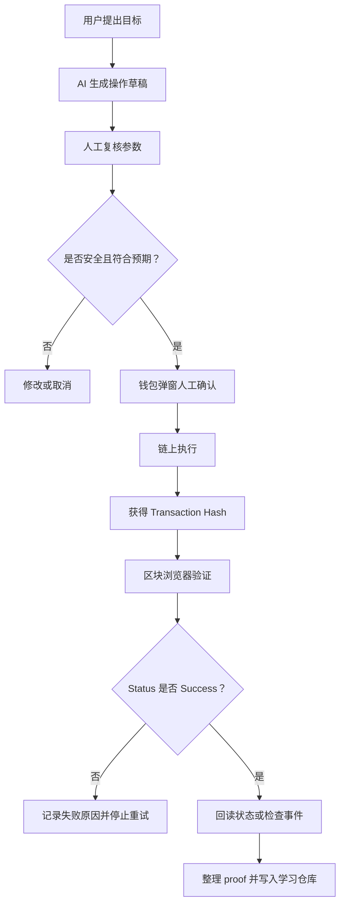
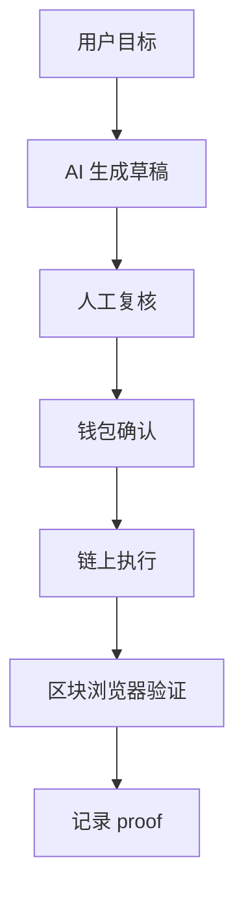

# 014｜AI x Web3 最小交叉流程图

日期：2026-05-27

状态：学习中。

## 本节目标

本节只解决一个问题：

```text
如何把 AI 辅助链上操作的最小安全流程画出来。
```

目标不是画得复杂，而是画出完整闭环：

```text
用户目标 -> AI 生成草稿 -> 人工复核 -> 钱包确认 -> 链上执行 -> 区块浏览器验证 -> 记录 proof
```

本节产出可以用于 WCB 任务：

```text
Week 1｜AI x Web3 综合任务｜画出 AI x Web3 最小交叉流程图
```

## 主线流程

最小流程：



## 每个节点要做什么

### 1. 用户提出目标

用户目标应该是明确、可检查的。

例子：

```text
把 SimpleStore 合约的 value 设置为 123。
```

不好的目标：

```text
帮我弄一下合约。
```

问题是目标太模糊，无法检查网络、函数、参数和结果。

### 2. AI 生成操作草稿

AI 可以生成：

- 调用步骤。
- 参数清单。
- 合约 ABI 解读。
- 脚本草稿。
- 风险提醒。
- proof 模板。

但草稿不是最终操作。

### 3. 人工复核参数

人工复核至少包括：

- Network / chainId。
- From。
- To / Contract Address。
- Function。
- Args。
- Value。
- Data。
- Gas。
- 是否涉及 approve、transfer、owner、admin、upgrade 等高风险动作。

### 4. 钱包确认

钱包确认是关键人工节点。

钱包弹窗里要再次检查：

- 网络是否正确。
- 地址是否正确。
- 金额是否正确。
- 函数和参数是否符合预期。
- 是否出现意外授权或转账。

### 5. 链上执行

交易发出后，不等于完成。

需要等待网络打包，并拿到 transaction hash。

### 6. 区块浏览器验证

验证不是只保存 hash，而是检查：

- Status。
- From / To。
- Value。
- Gas Fee。
- Block。
- Logs / Events。
- 如有状态变化，还要回读合约状态。

### 7. 记录 proof

Proof 应该能被别人复核。

至少包含：

- 任务目标。
- 网络。
- 合约地址或交易对象。
- Transaction Hash。
- Explorer Link。
- Status。
- 操作前后状态。
- 人工检查清单。
- 学习复盘。

## 失败点

常见失败点：

- AI 生成的网络错误。
- 合约地址错误。
- 参数错误。
- `value` 非预期转出原生币。
- `data` 解码后不是预期函数。
- Gas 异常。
- 钱包确认时没看清。
- Transaction Hash 有了，但 Status 是 Failed。
- 交易成功，但回读状态不符合预期。

## 回滚与停止策略

链上操作通常不能像普通数据库一样随便回滚。

所以更现实的策略是：

- 写入前尽量检查。
- 先在测试网练习。
- 小额操作。
- 出现 Failed 不盲目重复点击。
- 如果参数错误，先停下来复盘，不连续重试。
- 如果是授权风险，优先考虑撤销授权。

## Proof 模板

````markdown
## AI x Web3 最小交叉流程图



## 节点说明

- 用户目标：
- AI 生成内容：
- 人工复核字段：
- 钱包确认字段：
- 区块浏览器验证字段：
- Proof 字段：

## 风险边界

- 哪些节点必须人工确认：
- 哪些失败点需要停止：
- 哪些信息不能公开：
````

## 当前状态

- 014 已进入学习中。
- 先学习最小流程图，再做检查题或整理可提交 proof。
